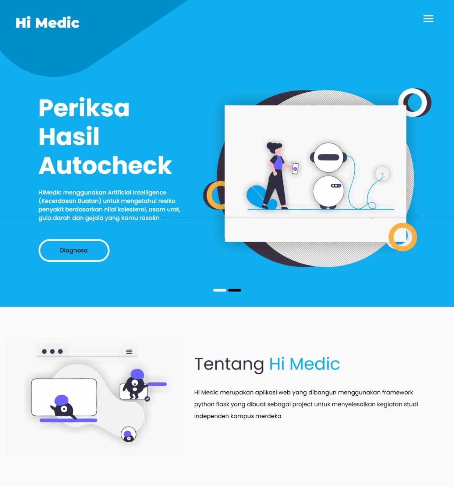
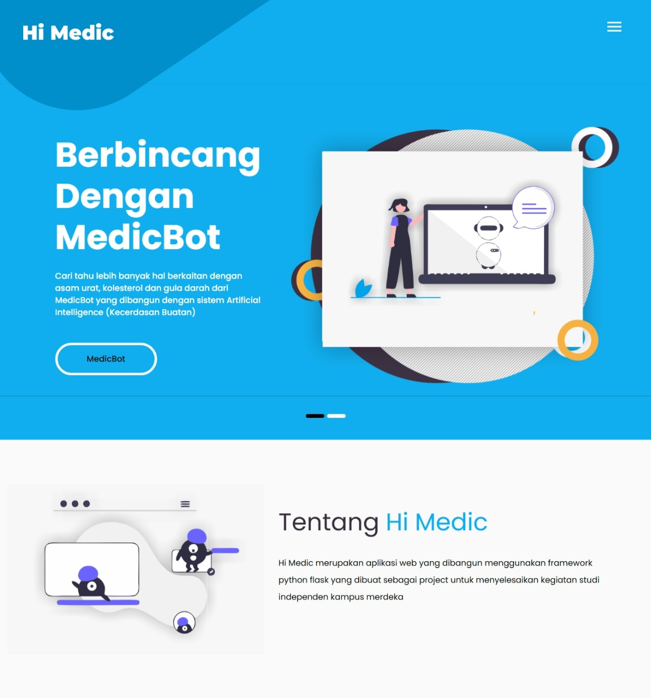
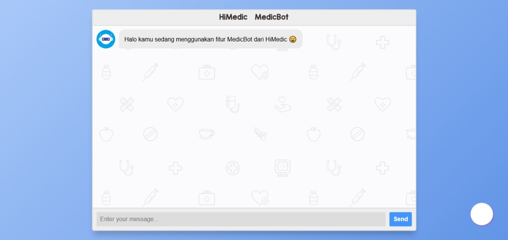
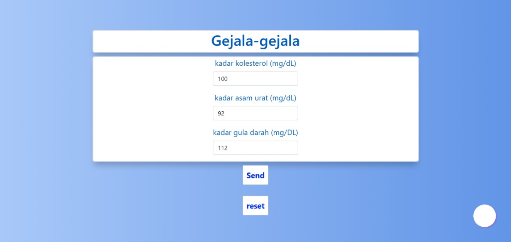
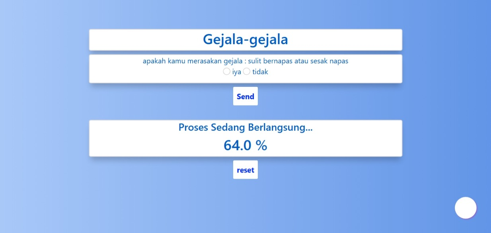

# 🏥 HiMedic  
## Machine Learning Chatbot & Auto-Diagnosis Recommendation System with Python

HiMedic is a web-based healthcare assistant built using **Python** and **Flask**.  
This project combines a health chatbot and an automatic diagnosis recommendation system using similarity-based machine learning.

---

## 📌 Introduction

HiMedic integrates two intelligent systems:

### 🤖 1. Health Chatbot
- Responds to health-related questions
- Built using Python & Flask
- Designed to assist users in understanding certain health conditions

### 🧠 2. Auto-Diagnosis Recommendation System
The recommendation system analyzes:

- User laboratory results (cholesterol, uric acid, blood sugar)
- Reported symptoms
- Encoded disease-symptom dataset

It applies **Cosine Similarity** to rank possible diseases and then provides:

- Most probable conditions
- Risk percentage
- Short explanation
- Lifestyle recommendations
- Food recommendations

Currently, the application is available in **Indonesian language**.  
Future updates will include English translation and expanded datasets.

---

## 🧠 System Architecture Overview

The system performs:

- Data preprocessing using Pandas
- Feature encoding for symptoms
- Laboratory value categorization
- Progressive filtering of possible diseases
- Cosine similarity ranking (scikit-learn)

---

## 🖥️ Application Overview

### 🏠 Home Page




Landing page introducing the system and navigation menu.

---

### 🤖 Chatbot



Interactive chatbot interface for health-related consultation.

---

### 🧾 Diagnosis Recommendation




Step-by-step symptom selection process that generates:

- Disease name
- Similarity percentage
- Explanation
- Lifestyle advice
- Food recommendations

---

## ⚙️ Tech Stack

- Python 3.10
- Flask
- Pandas
- NumPy
- Scikit-learn
- Cosine Similarity Algorithm

---

## 🚀 How to Run This Application (Offline)

> ⚠️ Important: This project runs best on **Python 3.10**  
> Some machine learning libraries are not fully compatible with newer Python versions.

### 1️⃣ Open Command Prompt (Windows)

I personally use Windows CMD.

---

### 2️⃣ Create Virtual Environment

```bash
py -3.10 -m venv himedic_env
```

Activate the environment:

```bash
himedic_env\Scripts\activate
```

---

### 3️⃣ Install All Requirements

```bash
pip install -r requirements.txt
```

---

### 4️⃣ Fix Werkzeug Version Issue (If Error Occurs)

If Flask installs an incompatible Werkzeug version:

```bash
pip uninstall werkzeug
pip install werkzeug==2.0.3
```

---

### 5️⃣ Run the Application

```bash
python app.py
```

If successful, you will see a local server address such as:

```
http://127.0.0.1:5000/
```

Open it in your browser.

---

## 📈 Future Improvements

- English language support
- More advanced NLP chatbot (transformer-based model)
- Expanded symptom & disease dataset
- Better state management (removing global variables)
- Cloud deployment
- User authentication system

---

## 🎯 Key Learning Outcomes

Through this project, I strengthened my understanding of:

- Data preprocessing & feature engineering
- Similarity-based recommendation systems
- Web application development with Flask
- Multi-module Python architecture
- State management challenges in web systems
- Debugging dependency & deployment issues

---

## 📌 Conclusion

HiMedic is a personal machine learning web application that integrates:

- Conversational AI
- Cosine similarity-based diagnosis filtering
- Lifestyle and preventive recommendation engine

Although not yet deployed to a production server due to hosting constraints, this project demonstrates applied machine learning logic in a real-world health use case.

This project reflects my continuous learning journey in:

- Data Science  
- Machine Learning  
- AI-driven Web Applications  

---

## 👤 Author

Muhammad Syamsul Bahri  
Statistics Graduate | Aspiring Data Scientist