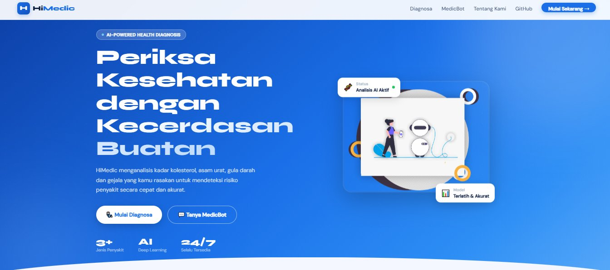
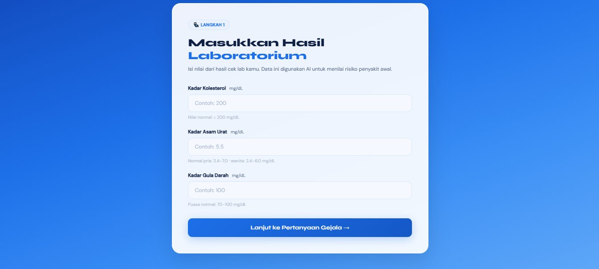
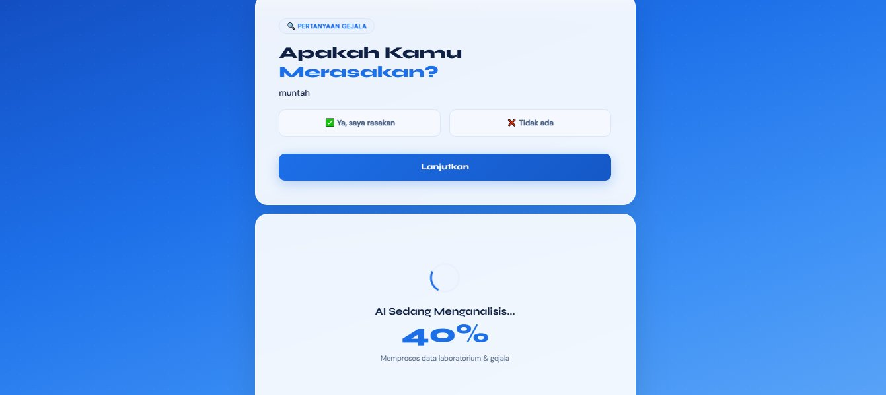
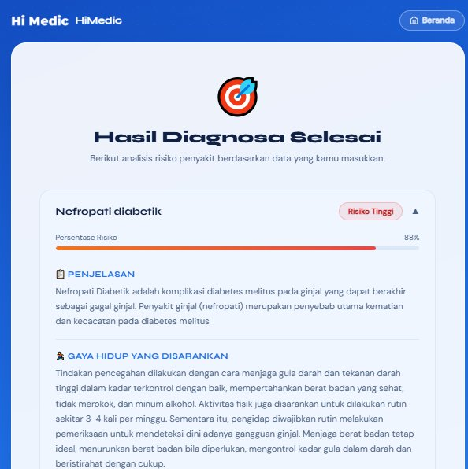
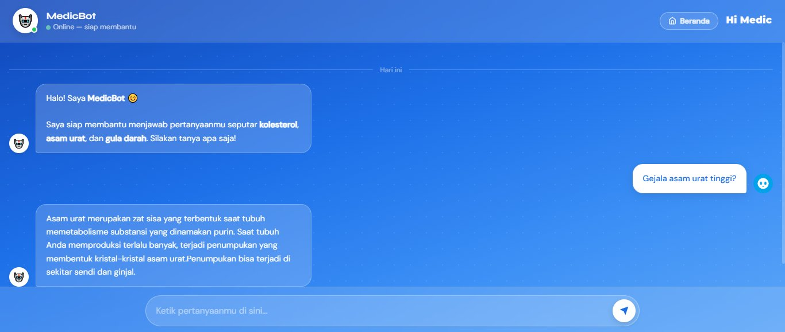

<div align="center">

# 🏥 HiMedic

### *AI-Powered Health Diagnosis Chatbot & Recommendation System*

**Periksa Kesehatan dengan Kecerdasan Buatan**

[](https://web-production-e1434.up.railway.app/)
[](https://www.python.org/)
[](https://flask.palletsprojects.com/)
[](https://www.tensorflow.org/)
[](https://scikit-learn.org/)

[**🌐 Try Live Demo**](https://web-production-e1434.up.railway.app/) · [**📖 Documentation**](#-documentation) · [**🐛 Report Bug**](https://github.com/Syamsul336/himedic-app/issues)

</div>

---

## 🌐 Live Demo

> **🔗 [https://web-production-e1434.up.railway.app/](https://web-production-e1434.up.railway.app/)**
>
> Aplikasi sudah ter-deploy dan dapat diakses langsung di browser.
> Hosted di Railway dengan free tier — gratis dan selalu online.

---

## 📌 Tentang HiMedic

**HiMedic** adalah aplikasi web berbasis kecerdasan buatan yang membantu pengguna menganalisis risiko penyakit berdasarkan kadar laboratorium (kolesterol, asam urat, gula darah) dan gejala yang dirasakan.

Aplikasi ini menggabungkan **dua sistem cerdas** dalam satu platform:

<table>
<tr>
<td width="50%">

### 🧠 Auto-Diagnosis System
- Berbasis **Cosine Similarity**
- Menganalisis kadar lab + gejala
- Filtering iteratif (eliminasi 40% per langkah)
- Output: penyakit + persentase risiko + saran lengkap

</td>
<td width="50%">

### 🤖 Health Chatbot (MedicBot)
- Berbasis **Deep Learning (Keras)**
- NLP dengan tokenizer & label encoder
- Topik: kolesterol, asam urat, gula darah
- Interaktif & responsif

</td>
</tr>
</table>

---

## ✨ Fitur Unggulan

| Fitur | Deskripsi |
|---|---|
| 🎯 **Diagnosis Cepat** | Analisis risiko 3+ jenis penyakit dalam hitungan detik |
| 📊 **Skor Persentase** | Setiap diagnosis dilengkapi nilai kemiripan (0–100%) |
| 🥗 **Saran Makanan** | Rekomendasi pola makan sehat per kondisi |
| 🏃 **Saran Gaya Hidup** | Tips lifestyle untuk mencegah/mengelola penyakit |
| 💬 **Chatbot Edukasi** | Tanya seputar kesehatan via AI assistant |
| 🌐 **Web-based** | Tidak perlu install — buka di browser, langsung jalan |
| 📱 **Responsive UI** | Desain modern, nyaman di desktop maupun mobile |

---

## 🖼️ Preview Aplikasi

### 🏠 Halaman Beranda

<div align="center">



*Landing page dengan UI modern bertema biru profesional*

</div>

---

### 🧪 Langkah 1 — Input Hasil Laboratorium

<div align="center">



*Form input nilai kolesterol, asam urat, dan gula darah sebagai data awal AI*

</div>

---

### ❓ Langkah 2 — Pertanyaan Gejala Iteratif

<div align="center">



*Sistem menanyakan gejala satu per satu dengan progress bar real-time*

</div>

---

### 📋 Langkah 3 — Hasil Diagnosa

<div align="center">



*Output lengkap: nama penyakit, persentase risiko, penjelasan, saran gaya hidup & pola makan*

</div>

---

### 🤖 MedicBot — Chatbot AI

<div align="center">



*Tanya jawab interaktif seputar kesehatan dengan AI berbasis Deep Learning*

</div>

---

## 🏗️ Arsitektur Sistem

```
┌─────────────────────────────────────────────────────────────┐
│                    HiMedic Application                       │
├─────────────────────────────────────────────────────────────┤
│                                                              │
│  ┌──────────────┐         ┌──────────────────┐              │
│  │   Frontend   │────────▶│   Flask Server   │              │
│  │  (HTML/CSS)  │◀────────│   (app.py)       │              │
│  └──────────────┘         └────────┬─────────┘              │
│                                    │                         │
│                  ┌─────────────────┴──────────────┐         │
│                  ▼                                ▼         │
│       ┌──────────────────┐          ┌──────────────────┐    │
│       │ Diagnosis Engine │          │  Chatbot Engine  │    │
│       │  (Cosine Sim)    │          │  (Deep Learning) │    │
│       └────────┬─────────┘          └────────┬─────────┘    │
│                │                              │              │
│                ▼                              ▼              │
│       ┌──────────────────┐          ┌──────────────────┐    │
│       │  CSV Datasets    │          │  Keras Model     │    │
│       │  (Symptoms +     │          │  (.h5 + tokenizer│    │
│       │   Food/Lifestyle)│          │   + label enc.)  │    │
│       └──────────────────┘          └──────────────────┘    │
│                                                              │
└─────────────────────────────────────────────────────────────┘
```

### 🔬 Algoritma Diagnosis (Iterative Cosine Similarity)

1. **Input lab** — User memasukkan nilai kolesterol, asam urat, gula darah
2. **Encoding** — Nilai numerik diubah ke kategorik (1=normal, 2=tinggi)
3. **Pertanyaan gejala iteratif** — Sistem menanyakan gejala satu per satu
4. **Filtering progresif** — Setiap 2 jawaban, sistem mengeliminasi 40% penyakit dengan similarity terendah
5. **Output final** — Saat tersisa ≤ 3 penyakit, tampilkan hasil + saran lengkap

---

## ⚙️ Tech Stack

<div align="center">

| Layer | Technology |
|---|---|
| **Backend** | Flask 2.0.3, Gunicorn |
| **Machine Learning** | TensorFlow-CPU 2.9.1, Keras 2.9.0, scikit-learn 1.1.3 |
| **NLP** | NLTK 3.7 (Punkt, WordNet) |
| **Data Processing** | Pandas 1.5.2, NumPy 1.23.1 |
| **Frontend** | HTML5, CSS3, Vanilla JS |
| **Deployment** | Railway (Docker-based) |
| **Runtime** | Python 3.10.13 |

</div>

---

## 🚀 Quick Start

### 🌐 Opsi 1: Akses via Web (Recommended)

Tidak perlu install apa-apa. Cukup buka:

> **👉 [https://web-production-e1434.up.railway.app/](https://web-production-e1434.up.railway.app/)**

---

### 💻 Opsi 2: Jalankan Lokal

#### Prasyarat

- Python **3.10** (versi lain mungkin tidak kompatibel dengan TensorFlow 2.9.1)
- Git
- 2GB RAM tersedia

#### Langkah-Langkah

**1. Clone repository**

```bash
git clone https://github.com/Syamsul336/himedic-app.git
cd himedic-app
```

**2. Buat virtual environment**

```bash
# Windows
py -3.10 -m venv venv
venv\Scripts\activate

# macOS / Linux
python3.10 -m venv venv
source venv/bin/activate
```

**3. Install dependencies**

```bash
pip install -r requirements.txt
```

**4. Download NLTK data** (opsional — sudah otomatis di `app.py`)

```bash
python nltk_setup.py
```

**5. Jalankan aplikasi**

```bash
python app.py
```

**6. Buka di browser**

```
http://127.0.0.1:5000/
```

---

### ☁️ Opsi 3: Deploy ke Railway

Panduan lengkap deploy gratis ke Railway tersedia di **[`DEPLOY_HIMEDIC.md`](DEPLOY_HIMEDIC.md)**.

Ringkasan singkat:

```bash
git init
git add .
git commit -m "Initial commit"
git remote add origin https://github.com/USERNAME/himedic-app.git
git push -u origin main
```

Lalu hubungkan repo GitHub ke Railway → auto-deploy.

---

## 📂 Struktur Project

```
HiMedic/
├── app.py                      # Entry point Flask
├── chatbot_medicbot/
│   └── chatbot_logic.py        # NLP chatbot (Keras)
├── sistem_rekomendasi/
│   └── rekomendasi_logic.py    # Cosine similarity engine
├── dataset/
│   ├── desease_symptoms.csv    # Mapping penyakit ↔ gejala
│   ├── food_n_style.csv        # Saran makanan & gaya hidup
│   └── himedic.json            # Intent dataset chatbot
├── model/
│   ├── model.h5                # Trained Keras model
│   ├── tokenizers.pkl          # NLP tokenizer
│   └── labelencoder.pkl        # Label encoder
├── templates/                  # HTML templates
├── static/                     # CSS, JS, images
├── preview/                    # Screenshot aplikasi
├── requirements.txt            # Python dependencies
├── Procfile                    # Gunicorn config (Railway)
├── runtime.txt                 # Python version pin
├── nltk_setup.py               # NLTK data downloader
├── DEPLOY_HIMEDIC.md           # Panduan deploy Railway
└── readme.md                   # File ini
```

---

## 🩺 Penyakit yang Dapat Dideteksi

Saat ini sistem mendukung deteksi risiko penyakit terkait:

- **Diabetes Melitus** (tipe 1 & 2)
- **Hiperglikemia** & **Hipoglikemia**
- **Hiperkolesterolemia**
- **Asam Urat (Gout)**
- **Hipertensi**
- **Penyakit Jantung Koroner**
- **Stroke**
- **Sindrom Metabolik**
- *...dan beberapa kondisi terkait lainnya*

> ⚠️ **Disclaimer:** Hasil diagnosa HiMedic adalah **estimasi berbasis AI** dan tidak menggantikan konsultasi medis profesional. Selalu konsultasikan kondisi kesehatan Anda dengan dokter.

---

## 🗺️ Roadmap

- [x] Cosine similarity diagnosis engine
- [x] Deep learning chatbot
- [x] Modern responsive UI
- [x] Deploy ke Railway (production)
- [ ] Multi-bahasa (English support)
- [ ] Per-user session management (replace global state)
- [ ] User authentication & history
- [ ] Transformer-based chatbot (BERT/IndoBERT)
- [ ] Expanded dataset (50+ penyakit)
- [ ] Mobile app (React Native)
- [ ] Integrasi BPJS / sistem rumah sakit

---

## 🎯 Apa yang Saya Pelajari

Project ini memperdalam pemahaman saya di bidang:

- 🔬 **Data preprocessing & feature engineering** untuk dataset medis
- 🧮 **Similarity-based recommendation systems** dengan cosine similarity
- 🌐 **Flask web development** & multi-module Python architecture
- 🤖 **NLP pipeline** dengan tokenization, lemmatization, dan deep learning
- 🐛 **Debugging production issues** (deployment, dependency conflicts, state management)
- 🚀 **Cloud deployment** dengan Docker-based platform (Railway)

---

## 🤝 Kontribusi

Kontribusi sangat diterima! Untuk perubahan besar, silakan buka issue dulu untuk diskusi.

```bash
1. Fork repo
2. Buat branch fitur (git checkout -b feature/amazing-feature)
3. Commit perubahan (git commit -m 'Add amazing feature')
4. Push ke branch (git push origin feature/amazing-feature)
5. Buka Pull Request
```

---

## 📜 License

Proyek ini didistribusikan di bawah lisensi MIT. Lihat `LICENSE` untuk detail lebih lanjut.

---

## 👤 Author

<div align="center">

**Muhammad Syamsul Bahri**

*Statistics Graduate · Aspiring Data Scientist*

[](https://github.com/Syamsul336)
[](https://www.linkedin.com/in/muhammad-syamsul-bahri/)

</div>

---

<div align="center">

### ⭐ Jika project ini membantu, jangan lupa kasih star ya!

**[🌐 Live Demo](https://web-production-e1434.up.railway.app/)** · **[🐛 Report Bug](https://github.com/Syamsul336/himedic-app/issues)** · **[💡 Request Feature](https://github.com/Syamsul336/himedic-app/issues)**

</div>
